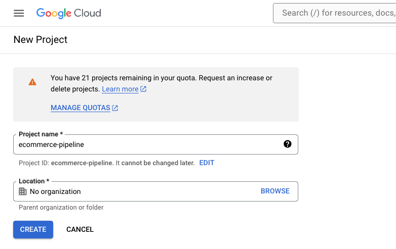

# Data Engineering Project

## Problem Statement

This project was part of the data engineering zoom camp 2024. 

The dataset chosen is [Ecommerce Dataset](https://www.kaggle.com/datasets/carrie1/ecommerce-data?resource=download).

Project next steps:
- rethink the api choice
- Write guide for setting up dev invironment in VM
- write down all the little tricks and commands
- goal is to write as I go 
    - gcp, docker, docker compose, ssh into vm, editing config (also for own documentation)
    - terraform for gcp? 
    - how to import api to gcp with mage

Todo:
- set up gcp vm environment
- install terraform
    - mage-zoomcamp-friedrich: cloud storage bucket, service account
- use mage (?) https://www.jonahboliver.com/blog/de-zc-w2
    - write python script to download kaggle dataset https://www.kaggle.com/datasets/carrie1/ecommerce-data?resource=download
    - push to google cloud storage
- use dbt cloud to move to bigquery and transform
    - maybe also use currency api to convert all sums to euro?
    - check for nulls (for example in customer_id)
- Display results in looker studio
    - create a map graph based on country code

# How to reproduce the project

Prerequisites:

- [www.gmail.com](http://www.gmail.com) account
- [www.kaggle.com](http://www.kaggle.com) account
- [www.getdbt.com](http://www.dbt.com) account

## Set up Google Cloud Platform (GCP) project

Set up a free gcp account. This allows you to spend 300 dollars as part of the free trial (that is more then sufficient for this project).

### Create a new project:

https://console.cloud.google.com/projectcreate

IAM & Admin > Service Accounts > Create Service Account

Link to the Looker Studio Dashboard

## Project Description

This project implements an ELT pipeline extracting the data from Kaggle, uploading to GCS and then transformed using dbt and bigquery. A dashboard is created to illustrate the findings.

[GCP Instructions](https://github.com/DataTalksClub/data-engineering-zoomcamp/blob/main/week_1_basics_n_setup/1_terraform_gcp/2_gcp_overview.md#initial-setup)

## Setup

This project is run on a compute engine instance. You must installed the following tools:

- Python 3.9
- Terraform
- Docker + Docker compose
- git

The startup.sh script will help you install a few of these components

### 1. Environment Setup

- [Python 3.9](https://linuxize.com/post/how-to-install-python-3-9-on-debian-10/)
- [Terraform](https://learn.hashicorp.com/tutorials/terraform/install-cli)
- [Docker](https://docs.docker.com/engine/install/debian/)
- [Docker Compose](https://docs.docker.com/compose/install/)

[Setup Video](https://www.youtube.com/watch?v=ae-CV2KfoN0&list=PL3MmuxUbc_hJed7dXYoJw8DoCuVHhGEQb)

[GCP Instructions](https://github.com/DataTalksClub/data-engineering-zoomcamp/blob/main/week_1_basics_n_setup/1_terraform_gcp/2_gcp_overview.md#initial-setup)

Create a .google/credentials/google_credentials.json with your service account

### 2. Clone Repo

With git installed in the repo. Clone this project and cd to the project folder

### 3. Run Terraform

Apply terraform to create GCS bucket and Bigquery

### 4. Setup Airflow

Update the docker compose file with your GCP paths and credentials. In the airflow folder run docker compose up. Start the DAGS!

- github_ingestion_gcs_dag
    - This ingests data converts to parquet to GCS
- gcs_to_bq_dag
    - Uploads creates table in bigquery
- dbt_run
    - Runs dbt models